# E-commerce Sales Performance Report

[← Back to Repository](../README.md)

## 1. Project Overview

This project aims to transform raw e-commerce data into actionable business intelligence. By building an end-to-end data pipeline, we have automated the cleaning, storage, and analytical processing of sales information. This report summarizes the key findings derived from the SQL-based analytical layer, focusing on customer segmentation, logistical efficiency, and sales performance.

## 2. Dataset Summary

The dataset includes transactional records covering:
- Customer Information: Unique identifiers and purchasing behavior.
- Sales Metrics: Revenue, costs, and payment methods.
- Operations: Shipment providers, priority levels, and return status.
- Geographical Data: Country-level distribution of sales.
- Rows: 49782
- Columns: 17
- Rows after cleaning: 44804
- Columns after cleaning: 19

## 3. Exploratory Data Analysis (EDA) using Python

Using Python and Pandas, the raw data underwent an ETL (Extract, Transform, Load) process:
- Data Cleaning: Handling missing values and ensuring consistent data types (e.g., converting revenue and costs to numeric formats).
- Transformation: Formatting dates and categorizing transaction statuses to prepare the dataset for relational analysis.
- Validation: Ensuring data integrity before uploading to the PostgreSQL database for advanced querying.

## 4. Data Analysis using SQL

Our analysis was divided into four core areas to provide a 360-degree view of the business:

- Profitability & Sales Performance: We identified the top-performing categories and monthly revenue trends.

1. Category Profitability Analysis
    - Which categories generate the highest total revenue? 
    - This helps in focusing marketing efforts.

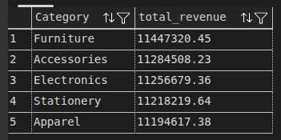

2. Time-Series Trend Analysis
    - What is the total revenue generated for each month of activity?

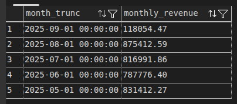

- Customer Behavior & Segmentation: We leveraged Window Functions to rank top products per category and identified "High-Value" customers based on purchase frequency and average ticket size.

3. Customer Behavior (Average Ticket)
    - What is the average spending per customer?
    - This helps in understanding the value of the user base.

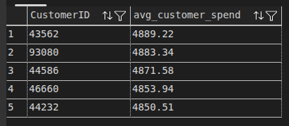

4. Advanced Filtering: High-Value Customers
    - Get the ID of customers who have made at least 5 purchases and have an average purchase spend greater than 500 currency units.

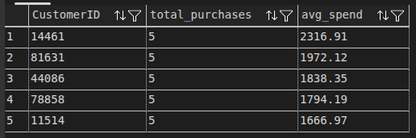

5. Top 3 most purchased products within each category
    - Identifies the best-selling items per category using window functions.

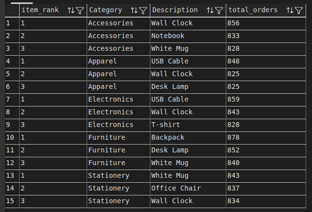

- Logistics & Operational Efficiency: We analyzed shipping costs relative to priority levels and evaluated return rates per product category.

6. Supply Chain Optimization
    - Which shipment providers have the highest average shipping costs?

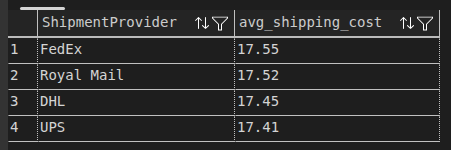

7. Order Priority Analysis
    - Is there a difference in average shipping costs based on OrderPriority?
    - This may reveal if "High" priority orders are more costly to process.

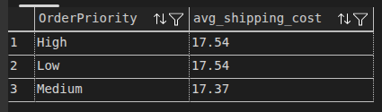

8. Churn/Returns Analysis
    - Which product category has the highest return rate? (i.e., what percentage of sales are marked as "Returned"?).

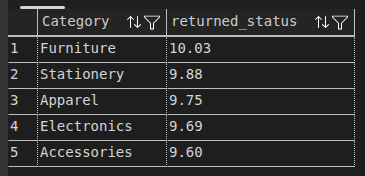

9. Shipping Cost vs. Return Status
    - What is the average shipping cost for orders that were "Returned" compared to those that were "Not Returned"?

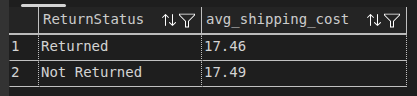

10. Most used Shipment Provider
    - Identify the most frequently used shipment providers and the total volume of completed shipments.

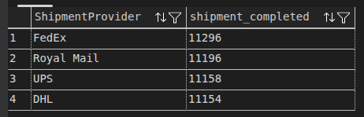

- Geographic & Payment Insights: We mapped sales volume by country and identified the most popular payment methods.

11. Payment Method Performance
    - Analyze the average spending and total revenue generated by each payment method to understand customer transaction preferences.

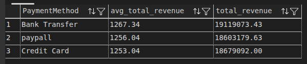

12. Top 5 Countries by Order Volume
    - Identify the top 5 countries based on order count and their respective total revenue generation.

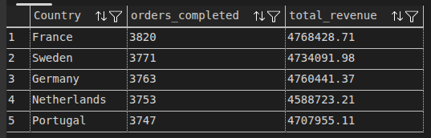

[← Back to Repository](../README.md)

## 5. Dashboard (KPI Visualization)

I have developed an interactive Power BI dashboard to transform processed data into strategic insights.

### Dashboard View

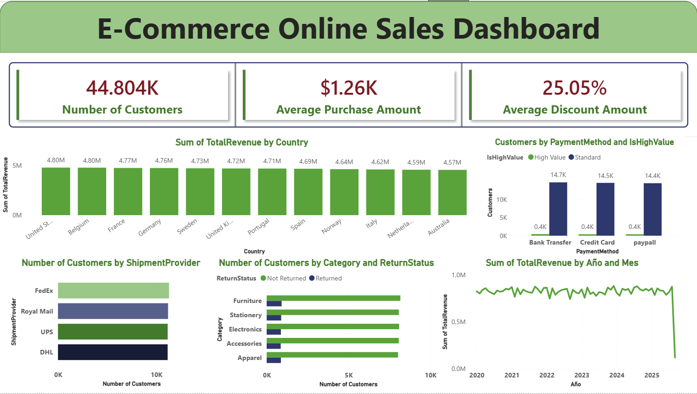

### Key Insights:
- **Behavioral Analysis:** I identified payment method preferences segmented by customer value (High Value vs. Standard).
- **Operational Health:** Real-time monitoring of revenue by country and temporal (monthly) trends.
- **Logistics and Quality:** Visibility into provider distribution and return rates by product category.

*Note: The dashboard was developed using Power BI Desktop and modeled using DAX for custom customer segmentation.*

## 6. Business Recommendations

Based on the data insights, we recommend the following strategic actions:
- Optimize Marketing Spend: Prioritize advertising for high-value customer segments identified in our SQL analysis.
- Logistical Review: Investigate shipment providers with the highest average shipping costs to identify potential cost-saving opportunities.
- Inventory Management: Increase stock availability for the "Top 3" best-selling items in each category to maximize revenue.
- Retention Strategy: Focus on categories with high return rates to investigate potential quality control issues or inaccurate product descriptions.